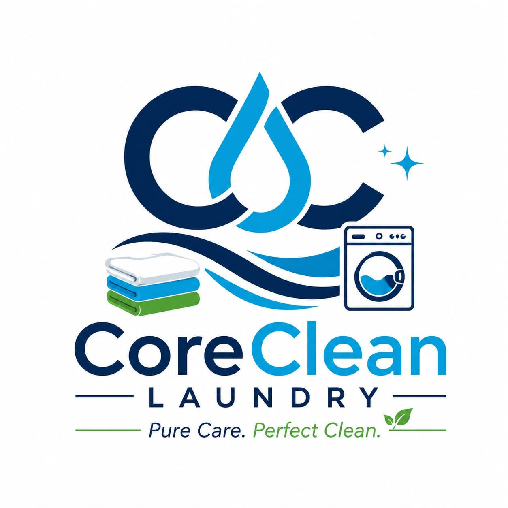

# 🧺 CoreClean Laundry Website



## Professional Commercial Laundry Services

CoreClean Laundry is a modern commercial laundry company providing hygienic, reliable, and professional laundry services for businesses. This website showcases our services, company profile, gallery, and contact information.

---

## 🌐 Website Features

- Responsive Design
- Modern User Interface
- Professional Homepage
- About Us Page
- Services Page
- Gallery
- Contact Page
- Quote Request Form
- WhatsApp Integration
- Google Maps
- Mobile Friendly
- Fast Loading
- SEO Friendly

---

## 📂 Project Structure

```
CoreCleanLaundry/

│── index.html
│── about.html
│── services.html
│── gallery.html
│── contact.html
│── quote.html
│── README.md

├── css/
│     └── style.css

├── js/
│     └── script.js

└── images/
      ├── coreclean-logo.png
      ├── hero.jpg
      ├── banner.jpg
      ├── about.jpg
      ├── gallery1.jpg
      ├── gallery2.jpg
      ├── gallery3.jpg
      ├── gallery4.jpg
      ├── gallery5.jpg
      └── gallery6.jpg
```

---

## 📄 Website Pages

### Home
- Hero Banner
- About Preview
- Services
- Why Choose Us
- Statistics
- Laundry Process
- Call to Action

### About
- Company Overview
- Mission
- Vision
- Core Values
- Laundry Process

### Services

Commercial Laundry Services including:

- Hospital Laundry
- Hotel Laundry
- Restaurant Laundry
- Industrial Laundry
- Uniform Laundry
- Pickup & Delivery

### Gallery

Professional image gallery showcasing:

- Hospital Linen
- Hotel Linen
- Restaurant Uniforms
- Industrial Uniforms
- Laundry Machines
- Pickup & Delivery

### Contact

- Contact Form
- Business Information
- Google Maps
- Social Media
- Business Hours

### Quote

Customers can request a customized quotation by providing:

- Company Name
- Contact Person
- Email
- Phone
- Business Type
- Laundry Quantity
- Service Required
- Additional Requirements

---

## 💻 Technologies Used

- HTML5
- CSS3
- JavaScript
- Font Awesome
- Google Fonts

---

## 📱 Responsive Design

Compatible with:

- Desktop
- Laptop
- Tablet
- Mobile

---

## 🎨 Color Palette

| Color | Hex |
|--------|------|
| Primary Blue | #0B5ED7 |
| Dark Blue | #084298 |
| White | #FFFFFF |
| Light Gray | #F8FAFC |
| Text Gray | #666666 |

---

## 📞 Contact Information

**CoreClean Laundry**

📍 Nashik, Maharashtra, India

📞 +91 XXXXXXXXXX

📧 info@corecleanlaundry.com

🌐 www.corecleanlaundry.com

---

## 🚀 Deployment

This website can be hosted on:

- GitHub Pages
- Netlify
- Vercel
- Hostinger
- GoDaddy
- Bluehost

---

## 📌 Future Improvements

- Online Booking System
- Customer Login
- Order Tracking
- Payment Gateway
- Admin Dashboard
- Blog
- Email Notifications
- SMS Notifications
- Customer Reviews
- Live Chat Support

---

## 📜 License

This project is developed exclusively for **CoreClean Laundry**.

Unauthorized copying, redistribution, or commercial use without permission is prohibited.

---

## 👨‍💻 Developed For

**CoreClean Laundry**

Professional Commercial Laundry Services

Serving Hospitals • Hotels • Restaurants • Industries • Corporate Offices

---

### © 2026 CoreClean Laundry. All Rights Reserved.
